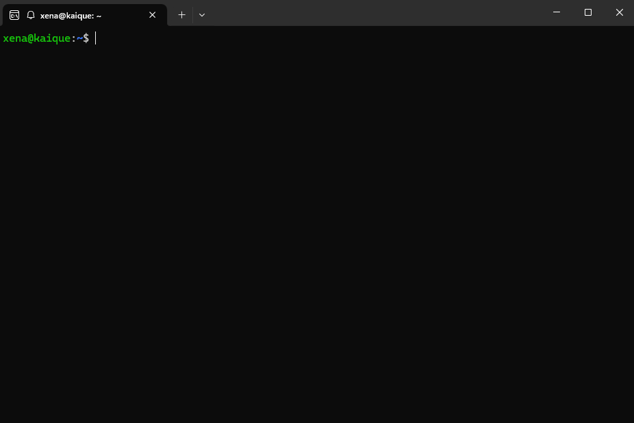

# Sistema de Conversao de Voz com GPT
Repositório para o trabalho da disciplina de Tópicos Especiais em Computação

Kaique S. Passos, Higor D. Oliveira, Victor F. Rocha

- [Descrição](#description)
- [Como rodar o código](#how-to-run-the-script)

  ## Description

  [Descrição aqui]

  ## How to run the script
    You're gonna need cuDNN to run this project. Follow the installation guide on the official website. The following link gives you the instructions for Ubuntu 24.04

    https://developer.nvidia.com/cudnn-downloads?target_os=Linux&target_arch=x86_64&Distribution=Ubuntu&target_version=24.04&target_type=deb_local

    To install the packages:

      pip install -r requirements.txt
  
  
  
